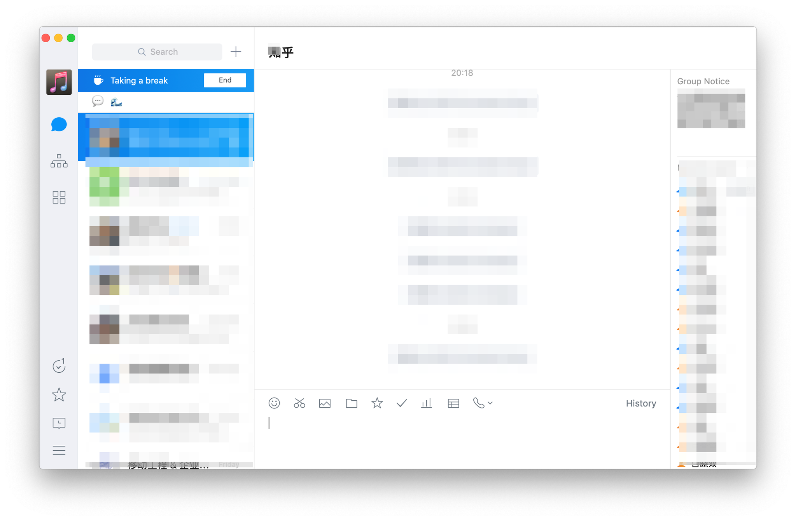
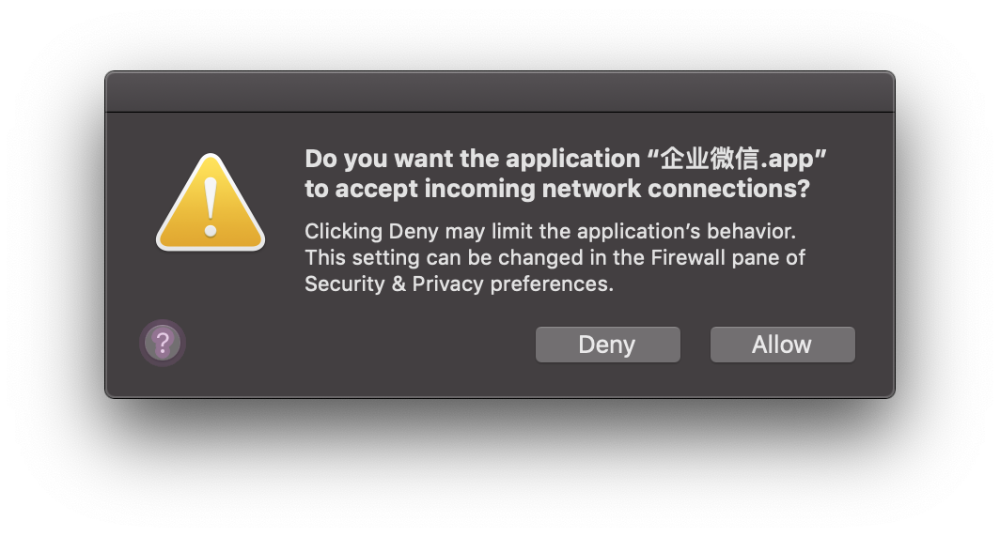

# 去除企业微信 Mac 端水印



## Install

```shell
# quit the app first
git clone git@github.com:X140Yu/WEWTweak.git
cd WEWTweak
sudo make install
```

`sudo make uninstall` to uninstall

## Known Issues

This alert pops up everytime I start the app, haven’t figure how to deal with it. 



## Credit

- [nygard/class-dump](https://github.com/nygard/class-dump)
- [Sunnyyoung/WeChatTweak-macOS](https://github.com/Sunnyyoung/WeChatTweak-macOS)
- [Tyilo/insert_dylib](https://github.com/Tyilo/insert_dylib)

## License

GPLv3, see LICENSE file for more information.
